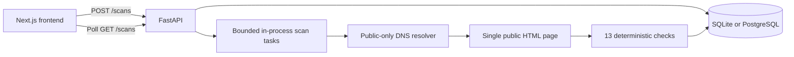

# M1 architecture

The API saves a scan before scheduling it. The frontend polls while scans are queued or running. Tasks save either the result or a user-facing failure reason. Results contain final URL, HTTP status, HTML fetch duration, document size, redirect count, scores, and individual checks with evidence and suggested fixes.

## Request boundaries

The scanner accepts public HTTP/HTTPS destinations on standard ports. A custom aiohttp resolver validates every returned address and passes those validated addresses directly to the connection layer. Literal IPs are checked before requests. Redirects are followed manually, with destination validation on each hop. Environment proxies and persistent cookies are disabled. TLS certificates are verified. Responses must be HTML and are bounded to 2 MB of decoded content. The entire fetch has a 25-second deadline.

## Persistence

SQLAlchemy creates the initial `scans` table with an ID, requested URL, status, UTC creation time, JSON result, and optional error message. SQLite lives in the backend directory by default. PostgreSQL uses the same model through psycopg. Startup marks queued/running records as failed because in-process work cannot survive a restart. Completed and failed records remain available; the list endpoint returns the most recent 100.

## Next milestones

Add migrations and a durable Redis-backed worker before deploying multiple API processes. Add accounts and ownership before sharing an instance. Crawling and rendered browser checks should use the same destination restrictions. Any future LLM should explain saved deterministic findings and never invent detections or change scoring.
