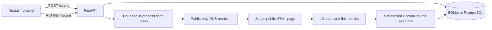

# M1 architecture

The API saves a scan before scheduling it. The frontend polls while scans are queued or running. Tasks save either the result or a user-facing failure reason. Results contain final URL, HTTP status, HTML fetch duration, document size, redirect count, scores, and individual checks with evidence and suggested fixes.

## Request boundaries

The scanner accepts public HTTP/HTTPS destinations on standard ports. A custom aiohttp resolver validates every returned address and passes those validated addresses directly to the connection layer. Literal IPs are checked before requests. Redirects are followed manually, with destination validation on each hop. Environment proxies and persistent cookies are disabled. TLS certificates are verified. Responses must be HTML and are bounded to 2 MB of decoded content. The page fetch has a 25-second deadline. Link probes have an 8-second budget. Malformed URLs are skipped and indeterminate responses are represented separately from verified failures.

## Persistence

SQLAlchemy creates the initial `scans` table with an ID, requested URL, status, UTC creation time, JSON result, and optional error message. SQLite lives in the backend directory by default. PostgreSQL uses the same model through psycopg. Startup marks queued/running records as failed because in-process work cannot survive a restart. Completed and failed records remain available; the list endpoint returns the most recent 100.

## Next milestones

Add migrations and a durable Redis-backed worker before deploying multiple API processes. Add accounts and ownership before sharing an instance. Future crawling must retain the same destination restrictions. Any future LLM should explain saved deterministic findings and never invent detections or change scoring.

## Rendered accessibility

Playwright launches a fresh sandboxed Chromium instance for each audit. Browser HTTP requests are intercepted and fulfilled by aiohttp using the public-only resolver; no browser credentials are forwarded. Resource redirects are followed manually and validated. A local deny proxy rejects traffic that escapes interception, while WebSockets and service workers are blocked. Browser requests are limited to GET, 80 resources, 3 MB per resource, and 15 MB combined. The browser phase has a 35-second deadline and closes Chromium on exit.

A pinned axe-core package installed with `npm ci` in `backend/` supplies nine selected rules. Results include pass/fail/inconclusive/not-applicable status, affected selectors, escaped HTML snippets, remediation text, and total affected-element counts. Up to 20 elements per rule are retained. The audit evaluates the main document after load plus a short settling interval; frames and later interaction states require manual review. Resource errors or script errors mark coverage partial. Confirmed violations are retained, and otherwise passing/not-applicable rules become inconclusive when rendering is incomplete. Browser unavailability preserves static results.

## Comparable reports

Reports carry scanner and scoring versions. Uncertain checks are excluded from scores. The frontend compares matching normalized URLs from the latest 100 saved scans, suppresses comparisons across rule versions, and suppresses score deltas when the evaluated check sets differ. A rule must transition from passed to failed to count as newly introduced, or failed to passed to count as resolved.
